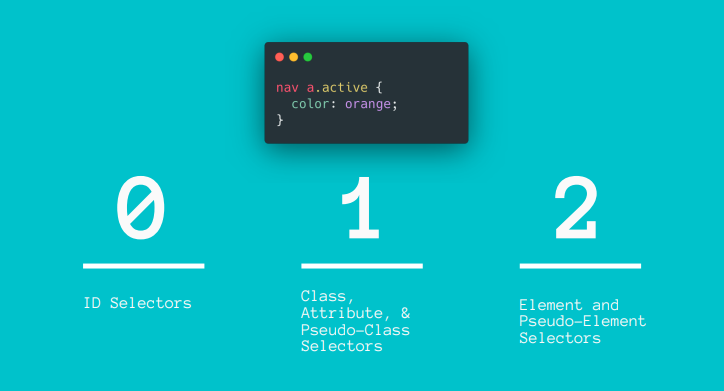
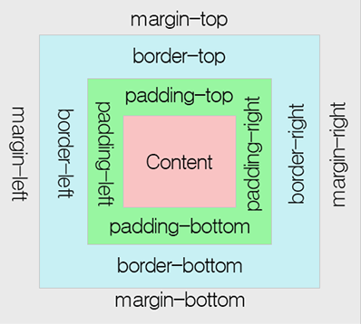

# Css-Basics
## CSS란?
CSS는 Cascading Style Sheets의 약자이다.  
HTML은 홈페이지의 뼈대를 잡아주고 CSS는 홈페이지를 꾸며준다.  
`빨간 공룡이 춤춘다`  
HTML은 명사(공룡), CSS는 형용사(빨간), 그리고 추후 배울 JS는 동사(춤춘다)를 담당한다고 해당 비유로 이해하면 된다.  

## 적용
CSS를 적용하는 방법은 세가지가 있다.
<ol>
    <li>Inline Style</li>
    <li>Internal Style Sheet</li>
    <li>External Style Sheet</li>
</ol>

### Inline Style
```
<body>
    <h2 style="color:green; text-decoration:underline">
    응애 나 아기 코린이
    </h2>
</body>
```
간혹 사용되는 방식이나 사용이 권장되지는 않는 방법이다.  
추후에 설명하겠지만 Inline Style의 경우 우선순위가 높게 잡힌다.  

### Internal Style Sheet
```
<head>
    <style>
        body { background-color: lightyellow; }
        h2 { color: red; text-decoration: underline; }
    </style>
</head>
```
`<head>`태그 안에 `<style>`태그를 사용하여 CSS 스타일을 적용하는 방법이다.  
굳이 알 필요는 없는 방법이다.  

### External Style Sheet
```
<head>
    <link rel="stylesheet" href="/examples/media/expand_style.css">
</head>
```
외부의 css파일을 연결해 하나의 css파일에서 관리할수 있게 하는 방식이다.  
보통 권장되는 방법이며 유지보수에 용이하다.  

## Color
CSS에서 색상을 표현하는 방법은 3가지가 있다.
<ol>
    <li>색 이름</li>
    <li>RGB</li>
    <li>Hex code</li>
</ol>

### 색 이름
```
h1 {
    color: red;
}
```
그냥 색상 이름을 타이핑하면 된다. 
대략 선택할 수 있는 색상이름은 140가지라고 한다.

### RGB
```
h1 {
    color: rgb(255,0,0);
}
```
요즘 모니터는 대부분 1600만 가지 이상의 색상을 표시할 수 있다.  
위의 색 이름으로 색을 표현하는 방법으로는 모든 색상에 이름을 지을수 없을뿐더러 이름을 전부 기억할 수는 없다.  
그러나 RGB는 위 문제에 대해 자유롭다.
픽셀을 최대한 확대해본다면 빨강, 초록, 파랑의 배열들로 구성된 것을 확인할 수 있다.
이 세 가지 색을 합한다면 화면의 모든 색을 만들 수 있다고 한다.  
0은 최소, 255는 최대치를 의미한다.

### Hex code
```
h1 {
    color: #f1f100;
}
```
위 RGB 방식과의 차이점은 Hex code는 16진법으로 표기하며 사용법은 유사하다.  
범위는 00부터 FF까지 있다.  
사실 RGB와 Hex Code는 크게 차이가 없다고 느끼는데 굳이 혼용을 하는 이유가 궁금해서 구글링을 해보았다.  

> Why do we have so many different color selecting options (e.g., hex, RGB, CMYK)? 
>    > Because we are used to different way, and we need sometime different models. “hex”? I assume this is sRGB web way to describe colours. Sometime you find a colour, and you want to modify: e.g. a green, but for some part you need a darker green: you input the existing code, and you modify it. “RGB”: it seems natural to many people, because computers works in RGB space. Especially if you want to do graphs, you can easily select the main colours (red, blue, green, yellow, magenta, orange, cyan, gray, etc.). With RGB you will be mostly consistent on multiple graphics. Then usually you have a HSL/HSV space: this is more natural. Often you want to light up or unsaturate a colour. If you need a shadow of an object (e.g. the shadowed side), with HSL it is very easy, no need to change every value of RGB (which are gamma corrected, so you must really care on how to change them). You can survive also with only one, and experience could help. But if you have more methods, you can select the more natural method for a specific tasks. With an hammer and a tape an engineer could fix everything, but it doesn’t mean these two tools are the best or more efficient tools for every work. Learn all tools, and then select the best one (for you).

도구는 다다익선이듯이 그저 개발자에게 주어진 추가적인 옵션이라고 이해하면 될 듯하다.

## Selector
스타일을 적용할 대상하기 위해 선택자(Selector)를 사용한다.  
<ul>
    <li>Universal Selector</li>
    <li>ID Selector</li>
    <li>Element Selector</li>
    <li>Class Selector</li>
    <li>Descendant Selector</li>
    <li>Adjacent Selector</li>
    <li>Direct Child Selector</li>
    <li>Attribute Selector</li>
</ul>

### Universal Selector
```
* {
    color: red;
}
```
문서의 모든 요소를 선택한다.  
안쓴다.

### ID Selector
```
#idname {
    color: red;
}
```
아이디는 고유한 식별자이므로 하나의 ID는 페이지 내에 한번만 나와야 함을 유의.
### Element Selector
```
p {
    color: red;
}
```
### Class Selector
```
.classname {
    color: red;
}
```
### Descendant Selector
```
li a {
    color: red;
}
```
`<li>`안에 모든 `<a>`를 선택한다.
### Adjacent Selector
```
h1 + p {
    color: red;
}
```
`<h1>`에 인접한 모든 `<p>`를 선택한다.
### Direct Child Selector
```
div > a {
    color: red;
}
```
`<div>`가 부모인 모든 `<a>`를 선택한다.
### Attribute Selector
```
input[type="text"] {
    color: red;
}
```
type 속성이 `text`인 모든 요소를 선택한다.
***

## Pseudo-Class
가상 클래스(Pseuodo-Class)는 선택자 끝에 붙여 요소의 상태를 특정하는 키워드이다.  
<ul>
    <li>:active</li>
    <li>:checked</li>
    <li>:first</li>
    <li>:first-child</li>
    <li>:hover</li>
    <li>:not()</li>
    <li>:nth-child()</li>
    <li>:nth-of-type()</li>
</ul>

## Cascade
CSS는 적용되는 스타일의 순서가 중요하다. 
마치 흐르는 폭포처럼 위에서 아래 순서로 적용이 된다.  
위에서 스타일이 적용된 요소가 아래에서 다시 스타일이 적용되는 경우 가장 마지막 스타일이 적용된다.
```
h1 {
    color: red;
}
```

```
h1 {
    color: blue;
}
```

## Specificity
우선순위(Specificity)는 충돌이 생길경우 브라우저에서 규칙을 적용하는 방법이다.  
충돌이 날 경우 브라우저는 선택자들끼리 얼마나 구체적인지 계산한 다음, 더 구체적인 선택자를 우선적으로 적용한다.  
  
일반적으로 공식은 ID > Class > Element이다. 계산 공식을 외울 필요는 없지만 알면 좋다. 
참고로 이를 계산해주는 [사이트](https://specificity.keegan.st/)가 있다. 

## Box-Model

모든 HTML 요소는 박스의 형태로 구성된다.  
이를 박스 모델이라고 일컫는다.  
박스 모델은 HTML 요소를 Padding, Border, Margin 그리고 Content로 구분한다.  


## Units
CSS에서 길이를 표현하는 단위들이다. 자주 쓰이는 단위들의 종류는 다음과 같다.
<ul>
    <li>px</li>
웹에서 유일하게 쓰이는 절대적 단위
    <li>em</li>
상대적 단위로 2em은 부모 요소보다 2배 크다는 의미이다.
    <li>rem</li>
루트 HTML 요소의 크기를 기준으로 하는 상대적 단위이다.
    <li>vw</li>
뷰포트의 width의 상대적 단위이다.
브라우저의 width가 640px일 경우 1vw는 6.4 vw가 된다.
    <li>vh</li>
뷰포트의 height의 상대적 단위이다.
브라우저의 height가 480px일 경우 1vh는 4.8 vw가 된다.
    <li>%</li>
부모 요소의 크기에 영향을 받는 상대적 단위이다.
50%로 설정할 경우 부모 요소의 절반 너비로 설정하게 되는 것이다.
</ul>


## References
http://www.tcpschool.com/css/css_intro_basic  
https://www.quora.com/Why-do-we-have-so-many-different-color-selecting-options-e-g-hex-RGB-CMYK
