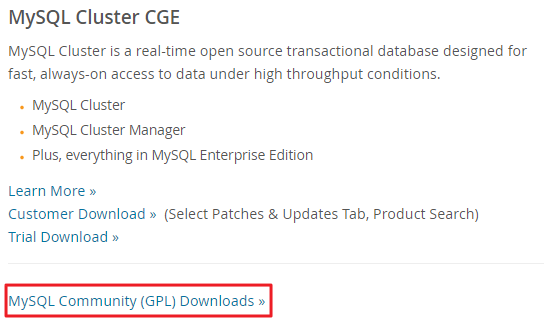
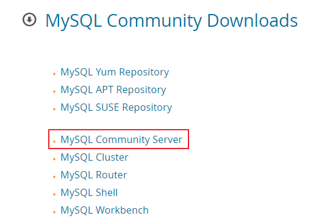
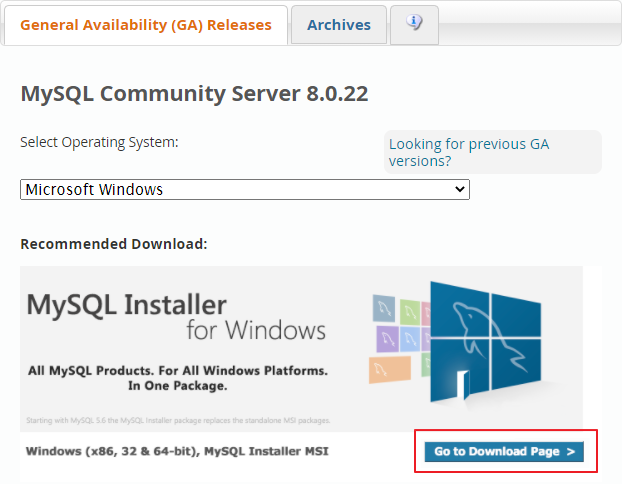
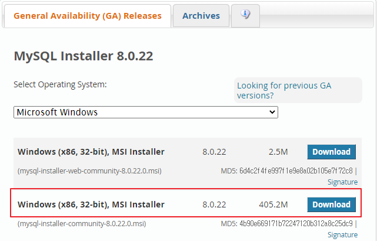

# Installation of MySQL  
***

### 1. <a href="https://www.mysql.com/downloads/">MySQL/Downloads</a> 접속  

### 2. MySQL Community Server 클릭  

### 3. Go to Download Page 클릭  
  
### 4. Download 클릭
### 5. 이후 쭉 Next, 비밀번호 설정을 하면 된다.