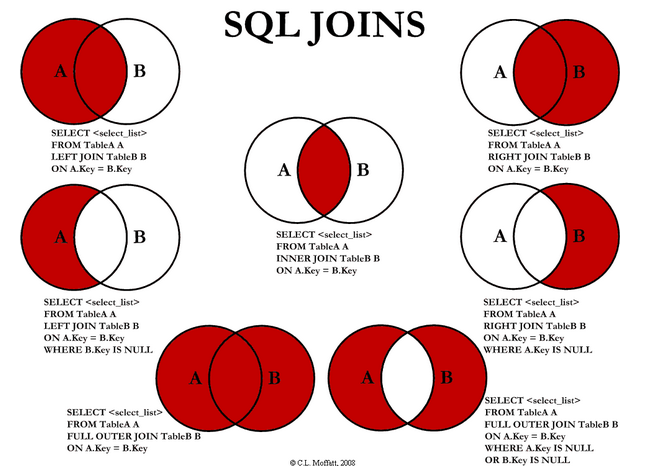

# Join
조인(Join)은 둘 이상의 테이블을 연결하는 방법이다. 연결하기 위해서는 테이블들이 하나 이상의 컬럼을 공유해야 한다.  

  
  
조인의 종류는 다음과 같다.
<ul>
    <li>
        Inner Join : 교집합
    </li>
    <li>
        Left/Right Join : 부분집합
    </li>
    <li>
        Outer Join : 합집합 - Oracle 고유의 문법이다.
    </li>
</ul>
테이블 예시는 다음과 같다. 

<table>
<thead>A</thead>
    <td>
        id
    </td>
    <td>
        name
    </td>
    <tr>
        <td>
            1
        </td>
        <td>
            프랑스
        </td>
    </tr>
    <tr>
        <td>
            2
        </td>
        <td>
            영국
        </td>
    <tr>
        <td>
            3
        </td>
        <td>
            독일
        </td>
    </tr>
</table>
<table>
<thead>B</thead>
    <td>
        id
    </td>
    <td>
        name
    </td>
    <tr>
        <td>
            1
        </td>
        <td>
            한국 
        </td>
    </tr>
    <tr>
        <td>
            2
        </td>
        <td>
            일본
        </td>
    <tr>
        <td>
            3
        </td>
        <td>
            중국
        </td>
    </tr>
    <tr>
        <td>
            4
        </td>
        <td>
            대만
        </td>
    </tr>
</table>

## Inner Join 
공통적인 부분(교집합)만 조인된다.
<pre><code>SELECT A.id, A.name, b.name 
FROM A INNER JOIN B
ON A.id = B.id;</code></pre>

<table>
    <td>
        id
    </td>
    <td>
        A.name
    </td>
    <td>
        B.name
    </td>
    <tr>
        <td>
            1
        </td>
        <td>
            프랑스
        </td>
        <td>
            한국
        </td>
    </tr>
    <tr>
        <td>
            2
        </td>
        <td>
            영국
        </td>
        <td>
            일본
        </td>
    <tr>
        <td>
            3
        </td>
        <td>
            독일
        </td>
        <td>
            중국
        </td>
    </tr>
</table>
여기서 id가 4인 대만은 B 테이블에만 있기 때문에 결과에 포함되지 않는다.

## Left Join
공통적인 부분(교집합) + 왼쪽 테이블(A) 모든 레코드를 조인한다.
<pre><code>SELECT A.id, A.name, b.name 
FROM A LEFT JOIN B
ON A.id = B.id;</code></pre>
<table>
    <td>
        id
    </td>
    <td>
        A.name
    </td>
    <td>
        B.name
    </td>
    <tr>
        <td>
            1
        </td>
        <td>
            프랑스
        </td>
        <td>
            한국
        </td>
    </tr>
    <tr>
        <td>
            2
        </td>
        <td>
            영국
        </td>
        <td>
            일본
        </td>
    <tr>
        <td>
            3
        </td>
        <td>
            독일
        </td>
        <td>
            중국
        </td>
    </tr>
</table>
결과적으로 A 테이블의 모든 레코드 + 공통적인 레코드를 출력하기에 대만은 결과에 포함되지 않는다.

## Right Join
공통적인 부분(교집합) + 오른쪽 테이블(B) 모든 레코드를 조인한다.
<pre><code>SELECT A.id, A.name, b.name 
FROM A RIGHT JOIN B
ON A.id = B.id;</code></pre>
<table>
    <td>
        id
    </td>
    <td>
        A.name
    </td>
    <td>
        B.name
    </td>
    <tr>
        <td>
            1
        </td>
        <td>
            프랑스
        </td>
        <td>
            한국
        </td>
    </tr>
    <tr>
        <td>
            2
        </td>
        <td>
            영국
        </td>
        <td>
            일본
        </td>
    <tr>
        <td>
            3
        </td>
        <td>
            독일
        </td>
        <td>
            중국
        </td>
    </tr>
    <tr>
        <td>
            4
        </td>
        <td>
            null
        </td>
        <td>
            대만
        </td>
    </tr>
</table>
B 테이블에만 있는 값인 대만이 출력되고 상응하는 A 테이블의 값이 NULL로 출력된다.

## Full Outer Join
왼쪽 테이블(A)과 오른쪽 테이블(B)의 모든 레코드를 조인한다.  
MySQL은 Full Outer Join을 지원하지 않는다. 그러나 Left Join과 Right Join을 사용해 유사한 결과를 얻을 수 있다.
<pre><code>SELECT A.id, A.name, B.name 
FROM A LEFT JOIN B ON A.id = B.id
UNION
SELECT A.id, A.name, B.name 
FROM A RIGHT JOIN B ON A.id = B.id
WHERE A.id IS NULL;</code></pre>
<table>
    <td>
        id
    </td>
    <td>
        A.name
    </td>
    <td>
        B.name
    </td>
    <tr>
        <td>
            1
        </td>
        <td>
            프랑스
        </td>
        <td>
            한국
        </td>
    </tr>
    <tr>
        <td>
            2
        </td>
        <td>
            영국
        </td>
        <td>
            일본
        </td>
    <tr>
        <td>
            3
        </td>
        <td>
            독일
        </td>
        <td>
            중국
        </td>
    </tr>
    <tr>
        <td>
            4
        </td>
        <td>
            null
        </td>
        <td>
            대만
        </td>
    </tr>
</table>