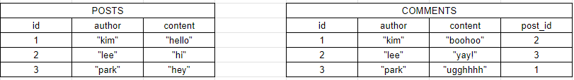

# DB-Basics

## Introduction
데이터베이스는 쉽게 데이터를 저장, 검색 등을 돕게해주는 도구이다.  
데이터베이스는 왜 필요할까? 데이터를 지속해야하기 때문이다.  
서버를 껏다 켜도, 무언가를 바꾸고 코드를 재배치해도, 어떤일이 있든 데이터는 지워지지 않고 유지되어야 한다.  
또한 데이터베이스의 역할은 데이터를 저장하고 보존하는데에 그치지 않고, 많은 데이터를 효율적으로 저장, 압축하고 관리하기 쉽게 만들어준다.  
무엇보다도 가장 큰 역할은 데이터를 간단하게 추가,선택,수정,삭제할 수 있게해준다.  
즉 서울에서 왕서방을 간단하게 찾을 수 있게 해준다는 의미이다.

## SQL VS NoSQL
데이터베이스의 유형은 SQL과 NoSQL 두가지로 구분된다.  

### SQL
SQL(Structured Query Language)은 구조화된 쿼리 언어의 약자이다.  
구조화된 쿼리 언어는 구조화된 정보의 모음에 상호작용 할수 있는 언어이다.  
SQL에서는 모든 일이 테이블에서 이루어지기에, 스키마와 테이블을 세팅한 후에야 데이터베이스에 무언가 추가할 수 있다.  


블로그에서 게시글을 작성하고 댓글을 작성할 수 있도록 사이트를 만든다고 가정해보자.  
댓글은 특정 게시글안에 작성하기때문에 게시글과 댓글을 연결해주어야 한다.  
이를 위해 COMMENTS 테이블이 POSTS 테이블을 연결하도록 id를 참조하도록 한다.  
이렇게 되면 특정 댓글은 특정 게시물이 이어지게 된다.
이러한 데이터베이스의 구조를 관계형 데이터베이스라고 하며, SQL은 관계형 데이터베이스를 조작하기 위한 언어이다.

### NoSQL
최근 NoSQL이 등장했는데, NoSQL은 SQL의 구조화된 쿼리언어를 쓰지않고 많은 요소를 몽땅 포괄하는 방식이다.  
마치 금화, 진주목걸이, 보석, 돈, 비법이 적힌 두루마리를 때려넣은 보물상자 처럼 말이다.

NoSQL은 데이터를 여러 테이블로 나눌 필요를 제거해주어, 따라야 할 스키마와 패턴을 미리 정하지 않아도 된다.  
대신 관련 정보를 데이터베이스의 한 인스턴스 안에 지정하면 된다.  
```
[
    {
        "id": 1,
        "author" : "smith",
        "text" : "lololol",
        "comments" : [
            "welcome!",
            "who are you?",
            "lmao"
        ]
    },
    {
        "id": 2,
        "author" : "matt",
        "text" : "kekeke",
        "dasdsa" : "asgdsakf"
    }
]
```
미리 정해진 스키마를 따르지 않고 그저 자료에 정보를 추가하기 때문에 훨씬 유연한 구조를 갖게된다.
기본적으로 SQL이 아닌 모든 것은 NoSQL이다.  


***
## References
https://gyoogle.dev/blog/computer-science/data-base/SQL%20&%20NOSQL.html