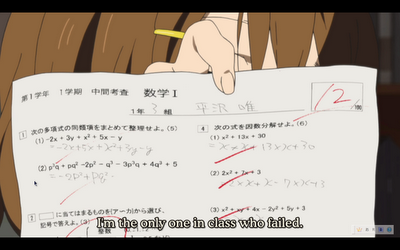
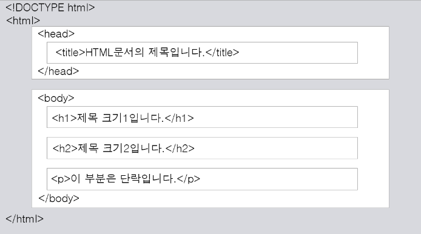
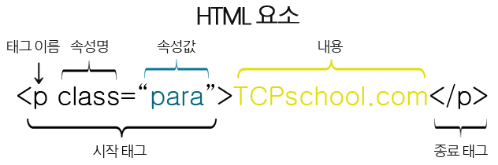

# HTML-basics
***

## HTML이란
HTML은 Hyper Text Markup Language의 약자이며
문서에 정보를 나타내기 위한 마크드업 언어이다.

## HTML의 구조
  
`<!DOCTYPE html>` : 브라우저에게 현재 문서가 HTML5[1](#footnote_1) 문서임을 알리는 역할을 한다.  
`<html>` : HTML 문서의 root 요소를 정의한다.  
`<head>` :HTML 문서의 메타데이터[2](#footnote_2)를 정의한다.  
`<title>` : HTML 문서의 제목을 정의하며 웹 브라우저의 툴바 및 즐겨찾기/ 검색 엔진의 결과 페이지에 제목으로 표시된다.  
`<body>` : HTML 문서의 내용을 정의한다.  
`<h1> ~ <h6>` : 각 섹션의 제목을 정의한다. 문서당 h1 태그는 하나만 존재할 수 있다.  
`
` : 단락을 나타내는 태그이다.

## Elements
요소(element)의 구조는 `<태그이름 속성이름= "속성값">`으로 표현된다.

## Div와 Span
둘다 제네릭 컨테이너의 역할을 하는 태그이나 
`
`는 block level의 태그이며 ``은 line level의 태그이다.

## HTML Entity
HTML에는 예약어(reserved characters)가 존재한다.  
대표적으로 꺽쇠, AND기호 등이 있다.  
이를 표현하려면 해당하는 기호에 대응하는 문자셋을 입력해야하는데 이를 엔티티라고 한다.

## Semantic 태그
시맨틱은 '의미와 관련된'이라는 의미의 형용사이며 시맨틱 마크업은 의미가 있는 마크업을 뜻한다.  
마크업에 의미를 부여하는 이유는 크롤링 프로그램 혹은 스크린 리더 등에 대해 보다 높은 접근성을 제공하기 위해서이다.  
크롤링 프로그램은 주로 nav바에 있는 모든 링크나 footer에 있는 모든 링크를 찾아 그들을 수집해 그 페이지를 방문하며, 이 과정을 재귀적으로 반복하는 전략을 사용한다.  
옛날의 웹 사이트들은 nav 혹은 footer가 어디에 있는지 명확하지 않아 이를 수행하기 어렵다.  
또한 개발자로 하여금 코드의 가독성을 높게 해준다는 소소한 이점도 있다.

***
<a id="footnote_1">[1](#note_1)</a> HTML의 최신 표준  
<a id="footnote_2">[2](#note_2)</a> HTML 문서에 대한 정보로 웹 브라우저에서는 직접적으로 표현되지 않는다.

## References
https://www.tcpschool.com/html/intro

