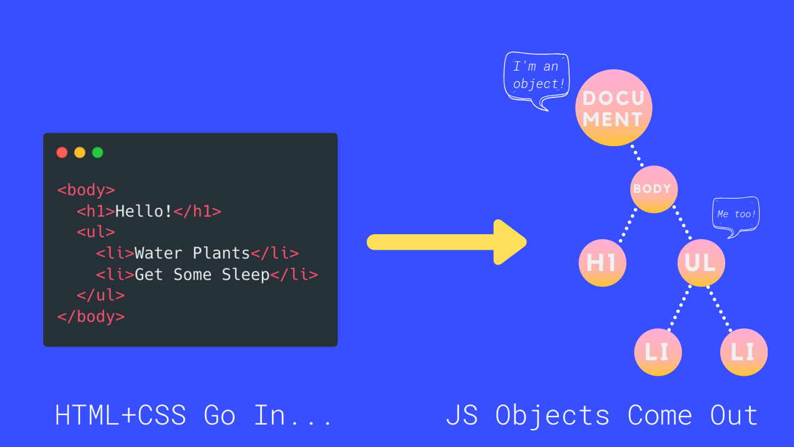

# DOM
## introduction
DOM(Document Object Model)은 웹 페이지를 구성하는 JS 객체들의 집합이다.  
HTML 요소로 h1태그가 있다면 이를 모델링하는 JS 객체가 있다.  
h1태그를 가리키는 이 JS객체를 변경하면 페이지에는 변경사항이 반영된다.  
즉 DOM은 JS에서 웹 페이지의 콘텐츠로 접근하는 창이자 통로라고 비유할 수 있다.  
브라우저는 웹 페이지를 띄울 때 HTML과 CSS 정보를 받아들인 후 요소와 스타일을 기반으로 JS객체를 생성한다.  
각 객체는 서로 연결된 트리구조를 띄게되며 최상단의 요소는 Document가 된다.
  
## Selecting
하나의 요소, 특정 클래스 혹은 특정 타입의 모든 요소 등을 선택한다.
### getElementById
해당하는 id의 요소를 선택하고 없을시 null을 반환한다.  
```
const name = document.getElementById('name');
```
### getElementsByTagName
웹 페이지내의 해당하는 모든 태그를 선택하고 HTML Collection을 반환한다. 배열이 아님을 유의한다.  
해당하는 값이 없다면 빈 HTML Collection을 반환한다.
```
const imgs = document.getElementsByTagName("img");
```
### getElementsByClassName
웹 페이지내의 해당 클래스를 가진 모든 요소를 선택하고 HTML Collection을 반환한다. 배열이 아님을 유의한다.  
해당하는 값이 없다면 빈 HTML Collection을 반환한다.
```
const animals = document.getElementsByClassName("animal");
```
### querySelector
최근 생겨난 문법으로 위에 언급된 선택법보다 간편하게 선택할 수 있다.  
```
// Finds first h1 element:
document.querySelector('h1');

// Finds all h2 element:
document.querySelectorAll('h2');

// Finds element with ID of red:
document.querySelector('#red');

// Finds first element with class of:
document.querySelector('.big');

// Finds all element with class of:
document.querySelectorAll('.big');

// Finds nth img element:
document.querySelector('img:nth-of-type(2)');
```

## Manipulating

### innerText
사용자에게 보여지는 텍스트를 반환한다.
```
document.querySelector('p').innerText = 'lol';
```
### innerHTML
요소에 포함된 마크업의 모든 텍스트를 반환한다.  
```
document.querySelector('h1').innerHTML = '<i>this is h1</i>';
```
대입연산자를 사용할수도 있다.
```
document.querySelector('h1').innerHTML += '<sup>1</sup>';
```

### textContent
노드 안에 있는 모든 텍스트를 반환한다.
```
document.querySelector('div').textContent = 'lmao';
```
## Dom-Events
DOM 이벤트는 사용자들이 하는 특정 행동에 반응하는 작업을 일컫는다.
### adding events
#### in-line
```
//index.html
<body>
    <h1>events</h1>
    <button onclick="alert('ouch!')">click me</button>
</body>
```
대충 봐도 알겠지만 HTML문서에 인라인으로 작성하기에 유지보수가 힘들어지고 가독성을 떨어뜨리기에 권장되지 않는 방법이다.

```
const btn2 = document.querySelector('#btn2');
btn2.onclick = function() {
    console.log("you got me!");
}
```
#### addEventListener
위의 방법은 동일한 이벤트에 대해 두개의 서로 다른 콜백함수를 지정할 수 없다.  
addEventListener 메서드는 이를 보완한다.
가장 많이 쓰이는 방법이다.
```
const btn3 = document.querySelector('#v3');
btn3.addEventListener('click', function() {
    alert("clicked!");
})
```

### event bubbling
```
<section onclick = "alert('section clicked')">
    <p onclick = "alert('p clicked')">
        <button onclick = "alert('button clicked')">click me</button>
    </p>
</section>
```
위 코드는 버튼을 클릭을 하면 해당 버튼의 함수가 발동되며 버튼의 부모요소, 버튼의 부모의 부모요소 순으로 거슬러 올라가며 마치 수조에서 공기방울이 올라오듯 이벤트가 실행된다.  
즉 의도하지 않은 이벤트를 발동시킬수 있다.  
이는 stopPropagation() 메서드를 이용해 버블링을 막을 수 있다.
```
const button = document.querySelector("button");
button.addEventListener("click", function(e){
    e.stopPropagation();
})
```

### event delegation
이벤트 위임은 개별 요소에 이벤트 리스너를 생성하는 대신, 상위 요소에만 이벤트를 생성하는 기법이다.  
메모리 사용량을 줄일 수 있으며 코드를 간결하게 구현하게 도와준다.
```
//html
<body>
    <section id = "container">
        <section id = "container2">
            <section id = "container3">
                ...
            </section>
        </section>
    </section>
</body>
```

```
//Before

const container = document.querySelector("#container");
const container2 = document.querySelector("#container2");
const container3 = document.querySelector("#container3");

container.addEventListener("click", function(){
    console.log("container clicked");
})

containe2.addEventListener("click", function(){
    console.log("container2 clicked");
})

container3.addEventListener("click", function(){
    console.log("container3 clicked");
})
```

```
//After

const container = document.querySelector("#container");

container.addEventListener("click", function(e){
    const id = e.target.id;
    console.log(`${id} clicked`);
})
```

***
## References
https://www.udemy.com/course/the-web-developer-bootcamp/  