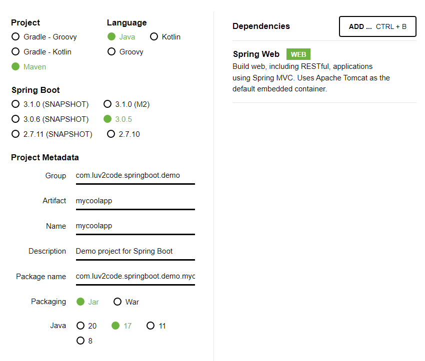
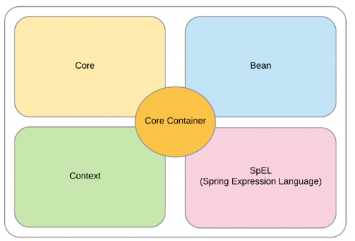
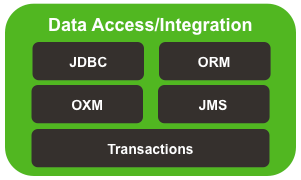
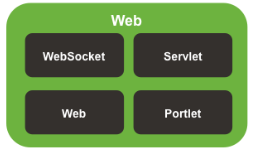

# Section1
## Spring Boot 3 Quick Start

### 요구사항
* Java 17 사용
  * Spring Boot 3은 Java17 이상의 버전을 요함
* Intellij 사용

### Spring Boot 개요
* 스프링은 자바 애플리케이션 개발에 매우 인기있는 프레임워크
* 많은 helper class와 annotation 제공

### 문제점
* 전통적인 스프링 애플리케이션 개발은 매우 어려움
  * 무슨 JAR dependencies가 필요한지
  * 어떻게 설정할지 (xml 혹은 Java)
  * 서버는 어떻게 설치할지 (Tomcat, JBoss, etc)
  * ...

### 해결법
* 스프링부트는 스프링 개발을 쉽게 시작하게 해준다.
* manual configuration을 최소화시켜준다.
  * 스프링부트는 속성 파일과 JAR classpath에 기반하여 자동으로 구성해준다.
* 스프링부트는 dependency 충돌을 해결하는데 도움을 준다.
* 스프링부트는 내장형 HTTP Server를 제공한다. (Tomcat, Jetty, Undertow, ...)

### 스프링부트와 스프링
* 스프링부트는 스프링을 배경으로 사용한다.
* 스프링부트는 간단하게 스프링을 쉽게 사용하게 만들어준다.

### Spring Initializr
* 스프링 프로젝트를 빠르게 만들어주는 웹 사이트
* dependencies를 선택하면 Maven/Gradle 프로젝트 생성
* 만들어진 프로젝트를 IDE로 Import할수있다.

### Spring Boot Embedded Server
* 스프링부트는 내장형 HTTP Server를 제공하기에 개발을 빠르게 시작할 수 있다.
* 서버를 따로 설치할 필요가 없다.

### Running Spring Boot Apps
* 스프링 부트 애플리케이션은 독립적으로 실행할 수 있다.

### Spring Boot FAQ
* Spring Boot가 Spring MVC, Spring REST 등을 대체합니까?
  * 아니오. 스프링 부트는 대신 이 기술들을 백그라운드에서 사용합니다.
* Spring Boot 코드가 일반 스프링 코드보다 빨리 코드를 실행합니까?
  * 아니오. 스프링 부트는 스프링 프레임워크와 동일한 코드를 사용합니다.

### Maven
메이븐은 애플리케이션의 프로젝트 관리 도구이다. 메이븐의 가장 큰 활용새는 management와 dependencies의 빌드이다.
Java 프로젝트를 개발할때 추가 JAR파일이 필요할 수 있다. example) Spring, Hibernate, Commons Logging, JSON etc...  
한가지 방법은 JAR 파일을 각각의 웹사이트에서 다운로드해 직접 build path 혹은 class path에 추가하는 방법이 있다.  
또 한가지 방법은 메이븐에게 필요한 dependencies를 알려주어 메이븐이 대신 위의 과정을 처리하게 하는 방법이다. 
메이븐은 JAR 파일을 컴파일과 실행하는동안 파일을 자동으로 사용가능하게 만들어준다.  
즉 비유하자면 Maven에게 쇼핑목록을 적어주고, Maven은 이 쇼핑목록이 적힌 종이를 가지고 대신 장을 보는 것이다.  
Maven의 동작은 다음과 같다.
1. 프로젝트의 설정 파일(쇼핑목록)을 Maven이 읽는다.
2. Maven은 로컬 컴퓨터 안의 Maven Local Repository을 체크하고 해당 파일이 없다면 ...

### Goals of Spring
* Java POJOs의 경량화된 개발
* 느슨한 결합을 촉진하기 위한 의존성 주입
* 상용구(boilerplate) 자바 코드의 최소화

### Core Container
  
코어 컨테이너는 기본적으로 Bean이 어떻게 생성되는지를 관리한다.  
Bean Factory는 Bean을 생성하는 역할을 가진다. bean factory는 속성과 dependencies를 정의하기 위해 config 파일을 읽는다.  
Context는 bean을 메모리에 저장하고 있는 스프링컨테이너이다.
SpEL은 Spring Expression Language의 약자로 config 파일안에 다른 bean을 참조하기 위한 언어이다.  

### Infrastructure
  
* AOP : logging, security, transactions, instrumentation과 같이 애플리케이션에서 공통적으로 쓰이는 서비스를 생성하게 해준다.

### Data Access Layer
  
관계형 데이터베이스 혹은 NoSQL 데이터베이스와 상호작용하는 영역
* JDBC : 스프링은 많은 helper class를 제공하는데 JDBC를 이용해 데이터베이스에 보다 쉽게 접근할 수 있게해준다.
* ORM : JPA나 Hibernate에 연결하게 해준다.
* JMS : 비동기적 방식으로 메세지를 메세지 큐에 보낼수있게 해준다. 

### Web Layer
  
Spring MVC Framework의 Home이다. 웹 애플리케이션을 스프링 코어로 개발할 수 있게 해준다.  
또한 스프링 컨트롤러와 스프링 뷰를 활용할 수 있다.

### Test Layer
  
스프링은 테스트 주도 개발을 지원한다. 스프링은 모방한 서블릿, jndi access등과 같은 모의 객체를 포함한다.

### Spring Project란
* 코어 프레임워크 위에 구축된 추가 스프링 모듈 (즉 애드온, 필요한 것만 쓸수 있다.)
  * example) Spring Cloud, Spring Data, Spring Batch, Spring Security, Spring Web Services, Spring LDAP, ...
* 말그대로 부가적인 옵션으로 필요하지 않다면 쓰지 않아도 무방하다.
