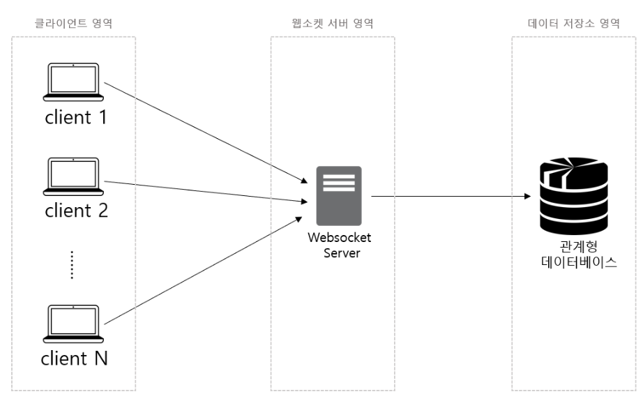
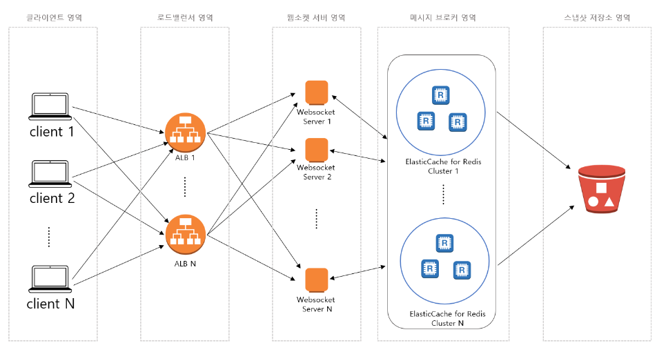
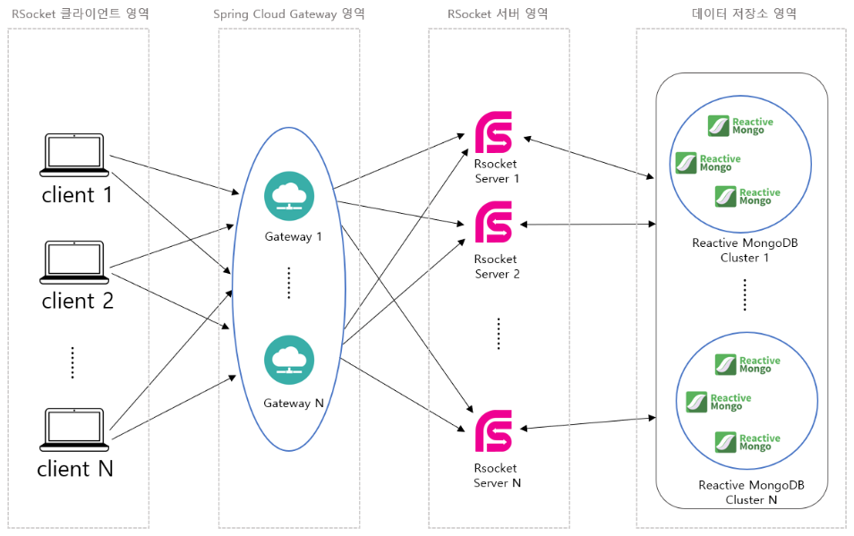
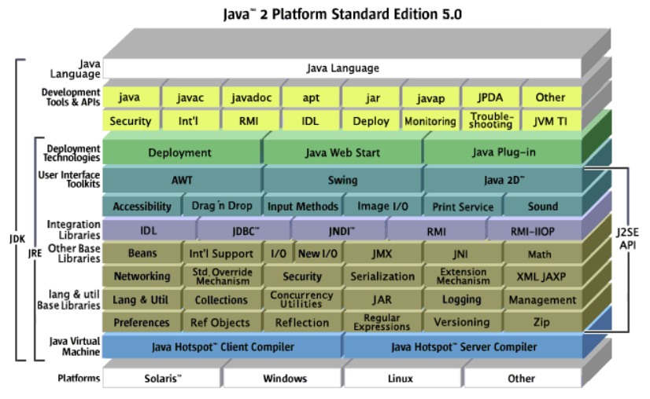
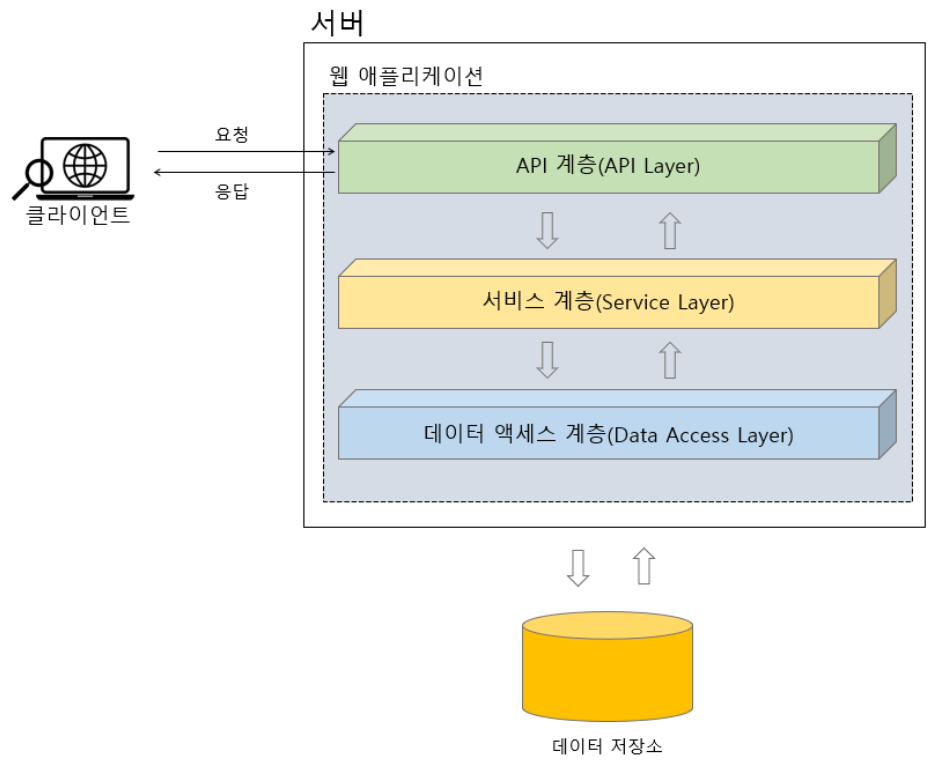
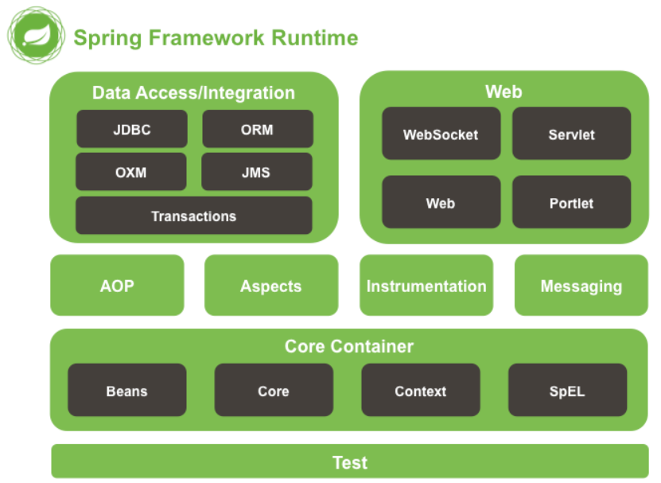

# Architecture
아키텍처(Architecture)는 소프트웨어 시스템을 설계할 때 필요한 전체적인 구조와 설계원칙을 뜻한다.  
건물을 짓기 전에 설계도를 그리는 것과 비슷한 개념으로, 건물을 짓기 전에 어떤 모양으로 지을 것인지 계획을 세우는 일이 아키텍처와 유사하다.  
건물의 층수는 몇층으로 할건지, 어떤 방향에 창문을 놓을것인지, 화장실과 부엌의 위치를 어디로 할 것인지 고려를 하게 되는데 이렇게 설계를 하면 집을 짓기 전후에 문제가 발생할 확률이 줄어들고 집을 짓는데 필요한 시간과 비용을 절약할 수 있다.  
이는 소프트웨어 아키텍처에서도 마찬가지로 아키텍처를 설계함으로써 소프트웨어 시스템구조와 설계원칙을 정의하고, 시스템을 구성하는 요소들의 관계와 역할을 정의할 수 있다.  
아키텍처는 너무 복잡해서는 안되며, 시스템이 커다랄수록 어느 정도의 복잡성은 필연적이나 기본적으로 최대한 간단하게 구조를 유지해야한다.  
컴퓨터 시스템에서 아키텍처의 유형은 System Architecture와 Software Architecture 두가지가 있다.
## System Architecture
시스템 아키텍처(System Architecture)는 하드웨어와 소프트웨어를 모두 포함하는 시스템의 전체적인 구조와 설계원칙을 나타낸 것이다.  
시스템 아키텍처를 통해 기본적으로 한 시스템이 어떤 하드웨어와 소프트웨어로 구성되며 사용되는지 대략적으로 파악할 수 있다.
### System Architecture Examples
  

위 이미지는 채팅 서버를 구축하기 위한 전통적인 시스템 아키텍처의 예시이다.  
사용자의 요청을 단일 서버가 모두 처리하므로 사용자가 감당할 수 없을정도로 늘어날 경우 문제가 발생한다.  
또한 단일 서버이기 때문에 해당 서버가 다운되면 시스템 전체가 마비되는 문제가 있다.  

  

위 이미지는 이전의 채팅 서버 아키텍처를 개선한 아키텍처의 모습으로 개선된 점은 다음과 같다.  
<ul>
    <li>
    아키텍처 사용자의 요청을 분산시키는 로드 밸런서 영역을 두어 웹소켓 서버를 안정적으로 운영 가능하다.
    </li>
    <li>
    여러대의 웹소켓 서버를 두어 더 많은 사용자의 요청을 처리할 수 있고, 몇몇 서버에 장애가 발생하더라도 시스템 전체가 마비되는 것을 방지한다.
    </li>
    <li>
    메시지 브로커 영역을 두어 웹소켓 서버가 다중 서버로 구성되더라도 특정 사용자들 간에 메시지를 주고 받을수 있는 공유채널을 사용 가능하다.
    </li>
</ul>

위 이미지는 채팅 서버의 전송속도를 향상 시키는 것을 목적으로 한번 더 개선한 아키텍처이다.
<ul>
    <li>
    리액티브 시스템을 구성하여 클라이언트의 요청을 보다 빠르게 처리 가능하다.
    </li>
    <li>
    웹소켓이 하나의 커넥션과 연결되는 것에 반해 RSocket은 하나의 커넥션 내에서 다중 요청 처리가 가능하기에 대량의 요청을 처리할 수 있다.
    </li>
</ul>

## Software Architecture
소프트웨어란 하드웨어를 제외한 컴퓨터내의 모든 프로그램을 의미한다. 이러한 소프트웨어의 구성을 큰 그림으로 표현한 것이 소프트웨어 아키텍처이다.  
Java 플랫폼 아키텍처의 예시를 들면 다음 이미지와 같다.  

  

### Web Application Architecture
애플리케이션은 소프트웨어 종류의 하나로서 좁게는 데스크탑이나 스마트폰에서 사용하는 응용 프로그램을, 넓게는 클라이언트의 요청을 처리하는 서버 애플리케이션을 의미한다.  
애플리케이션의 아키텍처 유형에는 Monolithic Architecture, Microservices Architecture, Serverless Architecture 등이 있다.  
본 글에서는 계층형 아키텍처(N-티어)에 대해서 다룬다.  

  

<ul>
    <li>
    API Layer
    </li>
    API 계층은 클라이언트의 요청을 받아들이는 계층이다. 표현 계층(Presentation Layer)라고도 하지만 REST API를 제공하는 애플리케이션의 경우 API 계층이라 표현한다.
    <li>
    Service Layer
    </li>
    서비스 계층은 API 계층에서 전달받은 요청을 업무 도메인<a href="#footnote_1" name ="note_1">1</a>의 요구사항에 맞게 비즈니스적으로 처리하는 계층이다. 애플리케이션의 핵심로직은 서비스 계층에 존재한다.
    <li>
    Data Access Layer
    </li>
    데이터 액세스 계층은 비즈니스 계층에서 처리된 데이터를 데이터베이스 등의 데이터 저장소에 저장하기 위한 계층이다.
</ul>

## Modules

위 이미지는 스프링 프레임워크에서 지원하는 모듈[2](#footnote_2)들을 아키텍처로 표현한 그림이다. 스프링 프레임워크에서는 약 20여개의 모듈을 통해 다양한 기능을 제공한다.

## 같이보면 좋은 문서
[Introduction to the Spring Framework 번역](https://github.com/haruday97/TIL/blob/main/Translations/Introduction%20to%20the%20Spring%20Framework%20%EB%B2%88%EC%97%AD.md)
***
<a name="footnote_1">[1](#note_2)</a> 애플리케이션 개발에서 사용되는 도메인(Domain)이란, 해당 애플리케이션이 다루는 문제 영역 혹은 주제 영역을 의미한다. 예를 들어 은행 애플리케이션의 경우 도메인은 금융 업무와 관련된 여러가지를 포함한다. 도메인은 비즈니스적인 업무영역과 관련이 있다.  
<a name="footnote_2">[2](#note_1)</a> Java에서는 일반적으로 지원되는 여러가지 기능들을 목적에 맞게 그룹화 하여 묶어놓은 것을 모듈이라고 부른다. 이러한 모듈들은 Java의 패키지 단위로 묶여 있으며, 이 패키지 안에는 관련 기능을 제공하기 위한 클래스들이 포함되어 있다. 일반적으로 모듈은 <b>재사용 가능하도록 라이브러리 형태로 제공된다.</b>

