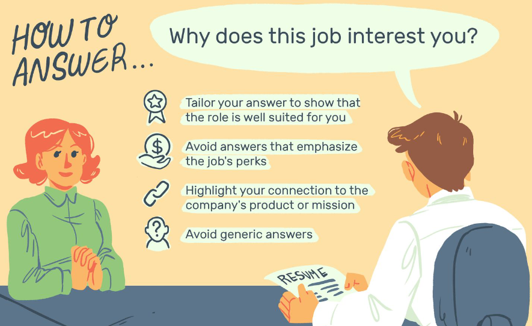
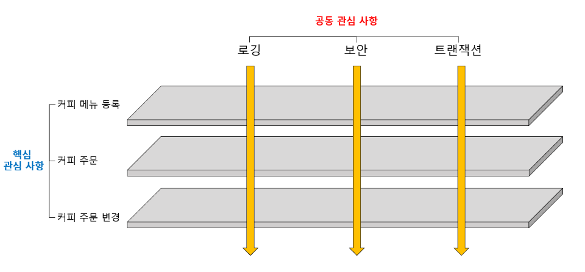

# Aspect Oriented Programming
AOP는 관심 지향 프로그래밍 정도로 번역할 수 있다.  
관심은 무엇을 의미할까? 

거의 모든 구직자는 양질의 일자리에 관심이 있을 것이다.  
사람에 따라 좋은 일자리의 기준은 다르겠지만 공통적인 관심사로는 급여, 복지, 근로환경 등이 있을 것이다.   
이처럼 AOP에서의 Aspect는 구인자들의 공통관심사와 마찬가지로 애플리케이션에 필요한 기능 중 공통적으로 적용되는 공통 기능에대한 관심과 관련이 있다.  

## Cross-cutting concern
애플리케이션을 개발하다보면 애플리케이션 전반에 공통적으로 사용되는 기능이 있기 마련이다.  
이러한 공통 기능들에 대한 관심사를 공통 관심 사항(Cross-cutting concern)이라고 한다.  

커피 주문을 위한 애플리케이션을 예로 하자면, 커피 종류를 등록하는 것과 커피를 주문하는 기능은 애플리케이션의 핵심 관심 사항에 해당한다.  
그러나 애플리케이션 보안에 대한 부분은 애플리케이션 전반에 공통적으로 적용되는 기능이기 때문에 공통 관심 사항에 해당된다.  

즉 AOP란 애플리케이션 핵심 업무 로직에서 로깅이나 보안, 트랜잭션 같은 공통기능로직들을 분리한 것이라고 할 수 있다.  

## Why do we need it?
애플리케이션의 핵심로직에서 공통 기능을 분리하는 이유는 다음과 같다.
<ul>
    <li>
    코드의 간소화
    </li>
    <li>
    코드의 재사용 
    </li>
    <li>
    객체 지향 설계원칙에 맞는 코드 구현
    </li>
</ul>

예를들어 트랜잭션 기능을 A클래스, B클래스 그리고 C클래스에서 사용해야한다고 가정하면, 해당 기능의 코드를 복사해서 각각의 클래스에 넣어주어야 할 것이다.  
이렇게 되면 코드가 길어지고, 중복되는 코드가 여럿 클래스에서 반복되며 만약 해당 기능을 수정해야한다면 여럿 클래스에서 다시 수정해야하는 불상사가 일어날 수 있다.  

