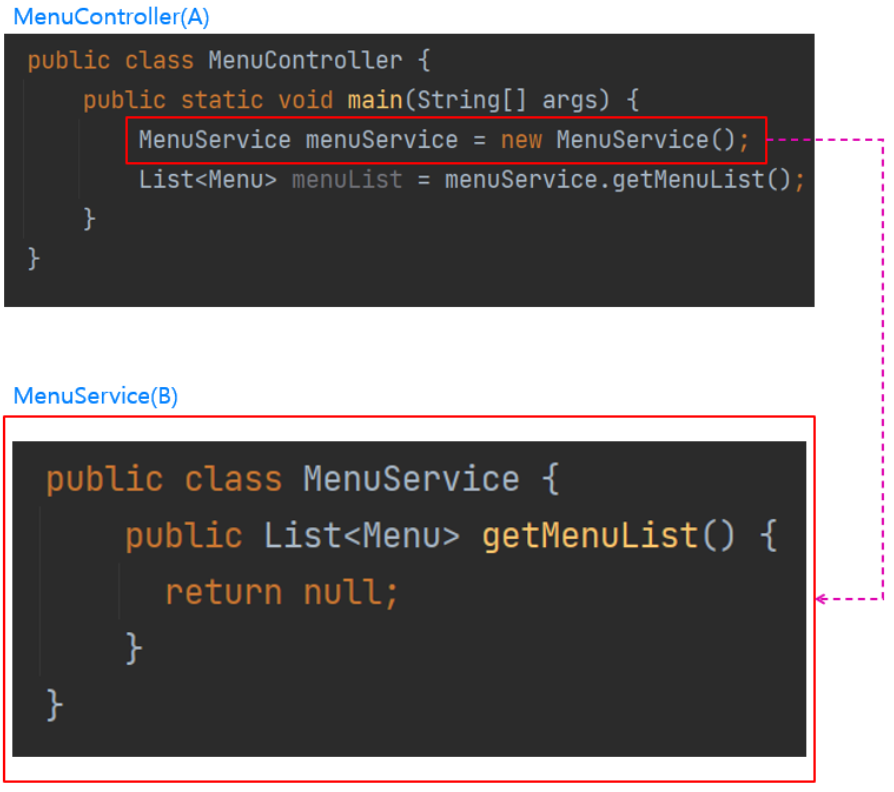
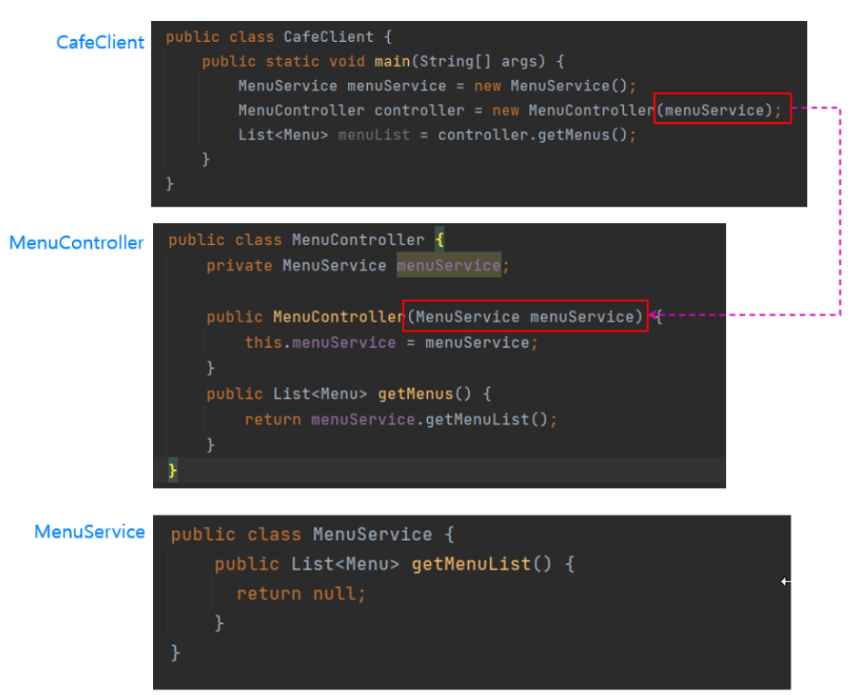
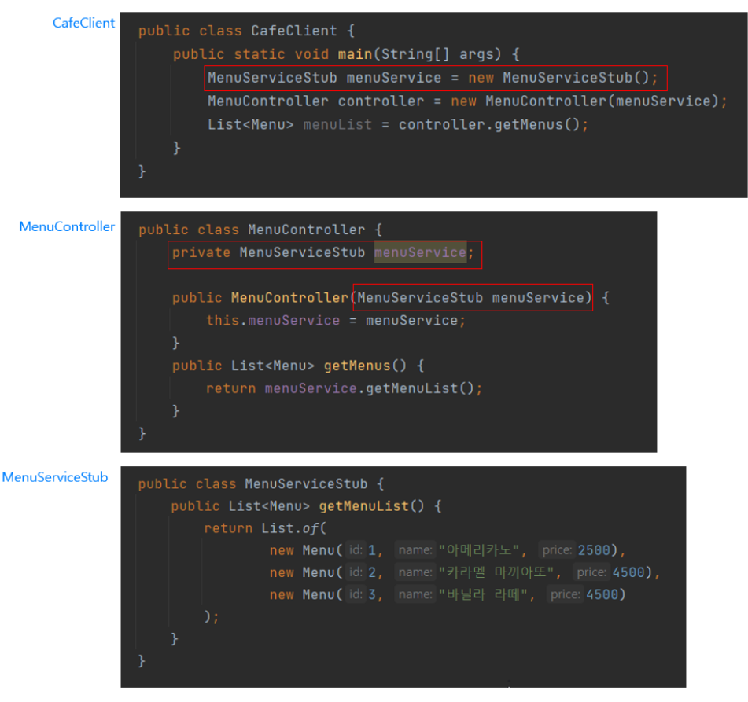
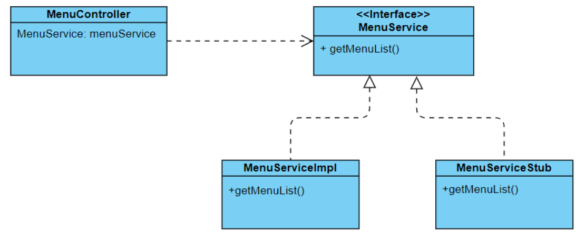
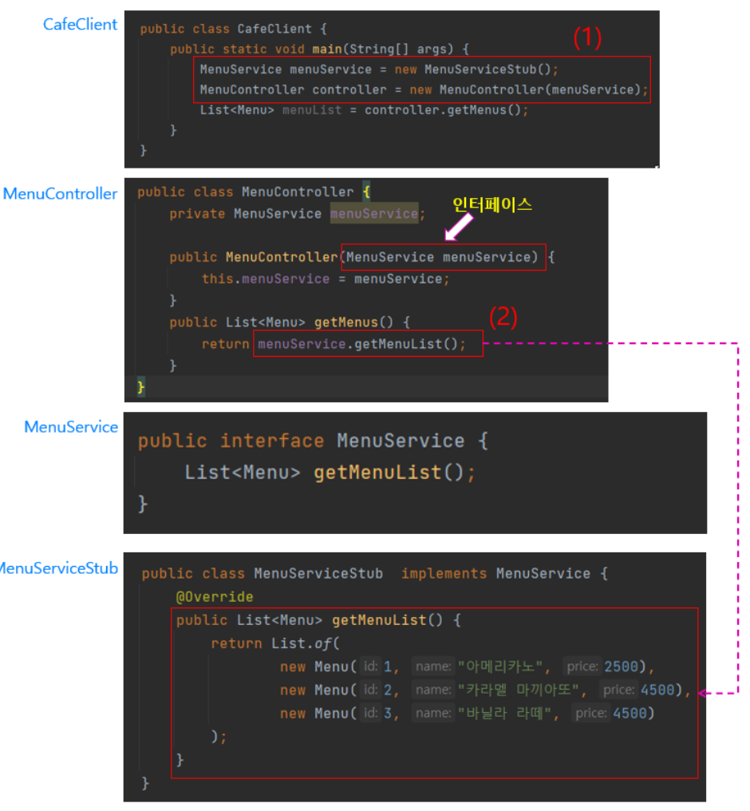
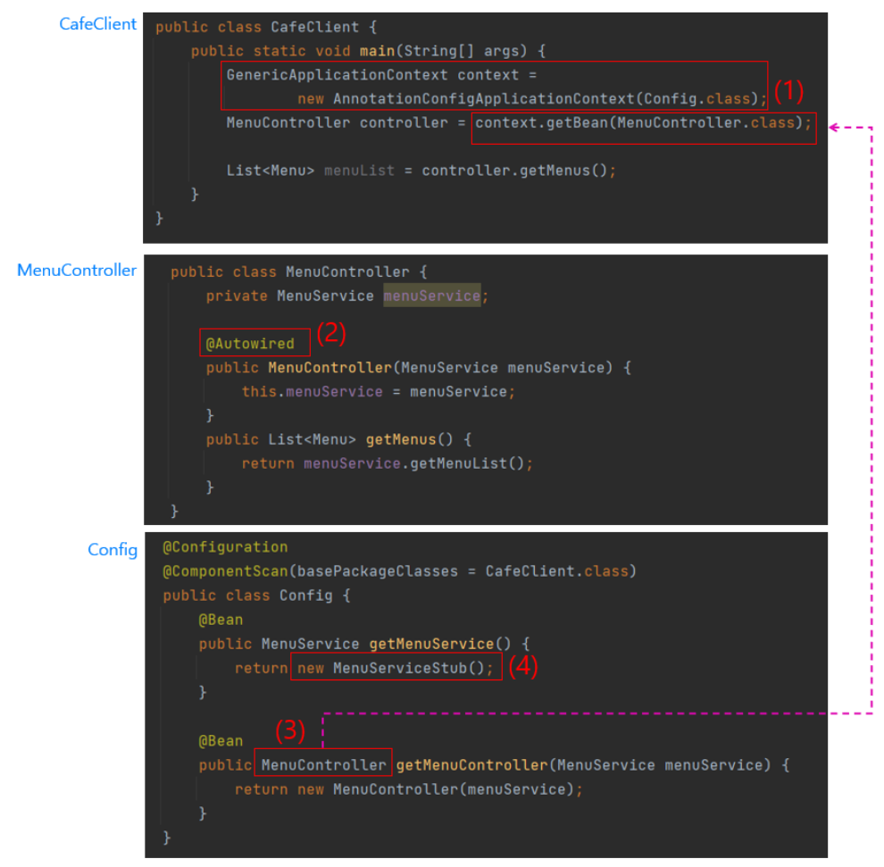

# Dependency Injection
IoC는 서버 컨테이너 기술, Design Pattern, 객체 지향 설계 등에 적용하는 일반적인 개념인데 반해 DI는 IoC 개념을 구체화시킨 것이라고 볼 수 있다.  
객체 지향 프로그래밍에서 의존성이라고 하면 대부분 객체 간의 의존성을 의미한다.  
예를들어 A클래스에서 B클래스의 메서드를 호출하면 A클래스는 B클래스에 의존하고있다고 말할 수 있다.  
  
위 그림에서 MenuController 클래스는 클라이언트의 요청을 받는 Endpoint[1](#footnote_1) 역할을 하고, MenuService 클래스는 MenuController 클래스가 전달받은 클라이언트의 요청을 처리하는 역할을 한다.  
MenuController 클래스는 메뉴판에 표시되는 메뉴 목록을 조회하기 위해 MenuService 클래스의 객체를 생성한 후, getMenuList() 메서드를 호출하고 있다.  
이처럼 클래스의 객체를 생성해서 참조하게 되면 의존관계가 성립하게 된다.

## How to inject Dependency
두 클래스 간에 의존 관계는 성립되었지만 아직 의존성은 주입되지 않은 상태이다.    

위 이미지는 의존성을 주입한 예시이다.  
기존의 MenuController 에서는 MenuService 객체를 생성했었지만 위 이미지에서는 MenuController 생성자로 CafeClient 클래스로부터 MenuService의 객체를 전달받고 있다.  
이처럼 생성자를 통해 외부로부터 어떤 클래스의 객체를 전달받는 것을 의존성 주입이라고 한다.  

## Do we really need it?

의존성을 주입할 때 개발자는 항상 현재의 클래스 내부에서 외부 클래스의 객체를 생성하기 위한 new 키워드를 사용할지의 여부를 고민해야한다.  
애플리케이션 코드 내부에서 직접적으로 new 키워드를 사용할 경우 객체지향 설계를 위반하는 문제가 발생할 수 있다.  

  
모종의 테스트를 위해 MenuServiceStub[2](#footnote_21) 클래스를 만들고 이로 MenuService 대체한다고 가정해보면,  
위 이미지처럼 개발자는 코드를 수정해야한다. 만약 MenuServiceStub 클래스를 사용하는 대상이 수천곳 있다면 또한 모두 변경해야하는 상황이 될것이다.  
이처럼 요구사항이 변경될 때 직접적으로 변경하는 상황은 바람직하지 않으며, new 키워드를 사용해서 의존 객체를 생성하면 클래스들 간에 강하게 결합되어 있다고 말한다.  
따라서 코드를 작성할 때 클래스들 간의 강한 결합은 지양하고 느슨한 결합을 지향해야한다.  
클래스들 간의 관계를 느슨하게 만드는 대표적인 방법으로는 인터페이스를 사용하는 방법이 있다.  

  

위 다이어그램 이미지에 따르면 MenuController는 클래스에 직접적으로 의존하지않고 MenuService 인터페이스를 의존하고 있다.  
이처럼 어떠한 클래스가 인터페이스에 의존하고 있을때, 클래스들 간에 느슨하게 결합되어있다고 말한다.  
위 다이어그램을 코드로 표현하면 다음과 같다.  

  

(1)에서는 new 키워드로 MenuService 클래스의 객체를 생성해서 MenuService 인터페이스에 할당한다.(Upcasting)  
클래스들 간의 관계를 느슨하게 만들기 위해선 new 키워드를 생성하지 말아야하는데, 여전히 CafeClient 클래스에서 new 키워드를 사용하고 있다.  
이를 어떻게 제거할까? 바로 Spring에서 대신해준다.  

## DI by Spring

위 이미지에서 new 키워드는 온데간데 없이 사라졌고, 그 자리에는 알수없는 코드들이 대신있다, 이들은 모두 Spring에서 지원하는 API 코드이다.  
(위 예시는 앞서 학습한 내용중에 POJO 프로그래밍의 규칙을 위반하지만 DI의 예시를 보여주기 위한 코드이다.)  
new 키워드는 사라지고 대신 Config라는 클래스가 새로 등장했는데 그 안에서 발견할 수 있다.  
Config 클래스 내에서 정의해둔 MenuController 객체를 Spring의 도움을 받아 CafeClient 클래스에 제공을 하고있다.  
Config 클래스는 애플리케이션의 핵심 로직에 관여하지 않으므로 단순한 클래스가 아닌, Spring Framework의 영역이다.

***
<a name="footnote_1">1</a> 클라이언트가 서버의 Resource를 이용하기 위한 끝 지점