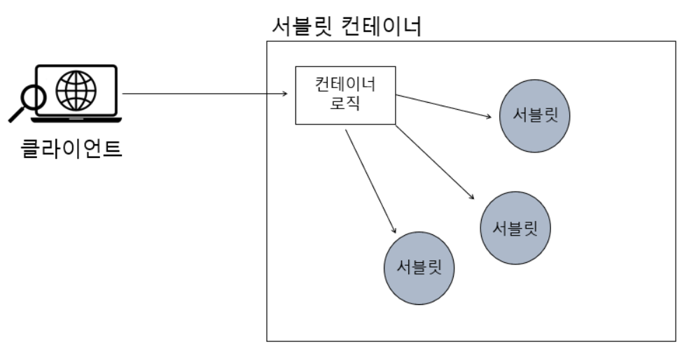

# Inversion of Control
라이브러리에서 애플리케이션 흐름의 주도권이 개발자에게 있고, 프레임워크는 애플리케이션 흐름의 주도권이 프레임워크에 있다.  
여기서 말하는 애플리케이션 흐름의 주도권이 뒤바뀐 것을 바로 IoC라고 한다.  

<pre>
    <code>
    public class example {
    public static void main(String[] args){
        System.out.println("Hello World!");
        }
    }
    </code>
</pre>

일반적으로 위 코드를 실행하려면 main() 메서드가 있어야한다.  
위 코드의 실행순서는 main 메서드 호출 -> System 클래스의 static 멤버변수 out의 println()을 호출한다.  
이것이 애플리케이션의 일반적인 제어 흐름이다.

## 웹 애플리케이션에서의 IoC

  
서블릿[1](#footnote_1)을 호출하는 서블릿 컨테이너[2](#footnote_2)의 예시.

현재까지 학습한 내용에 따르면 Java 콘솔 애플리케이션을 실행하면 main() 메서드가 있어야 했고, 이 메서드가 종료되면 애플리케이션의 실행또한 종료됐었다.  
하지만 웹에서 동작하는 애플리케이션은 사용자가 외부에서 접속하여 사용하는 서비스이다.  
이때는 사용자의 요청이 들어오면 서버에서 이 요청을 처리하고, 사용자에게 응답을 반환해야 한다.  
이 과정에서 main() 메서드가 종료되면 프로그램이 종료되어 요청을 처리할 수 없게 되므로 따라서 웹 애플리케이션에서는 main() 메서드가 종료되지 않아야 한다.

이를 위해 서블릿 컨테이너는 서블릿 사양에 맞게 작성된 서블릿 클래스만 존재하며 이들 서블릿 클래스는 별도의 main() 메서드를 가지지 않는다.  
대신 서블릿 컨테이너가 서블릿 클래스의 인스턴스를 생성하고, HTTP 요청에 대한 처리를 담당하는 메서드(doGet(), doPost())를 호출한다.  
이러한 방식으로 서블릿 컨테이너는 애플리케이션의 생명주기를 관리하며 클라이언트의 요청에 대한 응답을 처리하게 된다.

main() 메서드처럼 프로그램이 시작되는 지점을 <b>Entry Point</b>라고 부른다, 그런데 main() 메서드가 없는데 어떻게 애플리케이션이 실행되는걸까?  
그 이유는 서블릿 컨테이너 내의 컨테이너 로직(위 그림의 Service())이 서블릿을 직접 실행시켜주기 때문이다.  
이 경우 서블릿 컨테이너가 서블릿을 제어하고 있기 때문에 애플리케이션의 주도권은 서블릿 컨테이너에 있으며 IoC의 개념이 적용되어 있다고 볼 수 있다.  
Spring에서의 IoC는 의존성을 주입(DI)하는 형태로 개념이 적용되어 있다.

***
<a name="footnote_1">1</a> 서블릿(Servlet)은 자바 웹프로그래밍에서 동적인 웹 페이지를 만들기 위한 자바 클래스, 웹 서버에서 동작하며 클라이언트의 요청을 받아 처리한 결과를 다시 클라이언트에게 응답한다. 실생활에서 비유하자면 손님(클라이언트)의 주문을 주방장(서블릿)이 받아 해당 요리를 조리하고 그 음식을 손님에게 제공하는 것과 같다.   
  
<a name="footnote_2">2</a> 서블릿의 생명주기를 관리하고 서블릿의 요청을 처리하는데 필요한 환경을 제공하는 서버 프로그램이다. 웹 서버와 연동하여 동작하며 서블릿 요청이 들어오면 해당 요청을 처리할 서블릿을 실행한다. 예를들어 웨이터(서블릿 컨테이너)는 손님(클라이언트)에게 한식 요리를 주문받으면 한식을 담당하는 요리사(서블릿)에게 주문을 전달하고 결과를 손님에게 전달하는 역할을 한다.  
