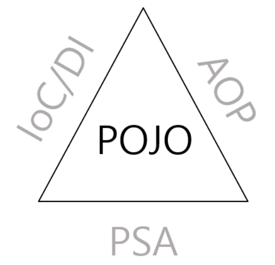

# Plain Old Java Object
  
POJO(Plain Old Java Object)란 순수한, 즉 특별한 기술이나 라이브러리를 사용하지 않은 일반적인 자바 객체를 의미한다.  
POJO는 Spring의 핵심 개념들인 IoC/DI, AOP, PSA를 통해 이룰 수 있다.  

## POJO Programming
POJO 프로그래밍은 POJO를 이용해 프로그래밍 코드를 작성하는 것을 의미한다.  
단순히 순수 자바 객체만을 사용해서 코드를 작성했다고 해서 POJO 프로그래밍이라고 간주하지 않으며, 크게 두 가지의 기본적인 규칙을 준수해야한다.  
<ul>
    <li>
    Java나 Java의 사양에 정의된것 이외에는 다른 기술이나 규약에 얽매여선 안된다.
    </li>
    <li>
    특정 환경에 종속적이지 않아야 한다.
    </li>
</ul>

### POJO 프로그래밍이 필요한 이유
<ul>
    <li>
    재사용 가능하며 확장이 유연한 코드를 작성할 수 있다.
    </li>
    <li>
    코드가 간결해진다.
    </li>
    <li>
    코드가 간결해지므로 디버깅이 쉬워진다.
    </li>
    <li>
    테스트가 단순해진다.
    </li>
    <li>
        <b>객체지향적인 설계를 제한없이 적용할 수 있다.</b>
    </li>
</ul>

### POJO와 Spring의 관계
스프링은 POJO 프로그래밍 지향 프레임워크이다.  
POJO 프로그래밍 코드를 작성하기 위해서 스프링은 세가지 기술을 지원하는데, 이들이 바로 IoC/DI, AOP, PSA이다.

