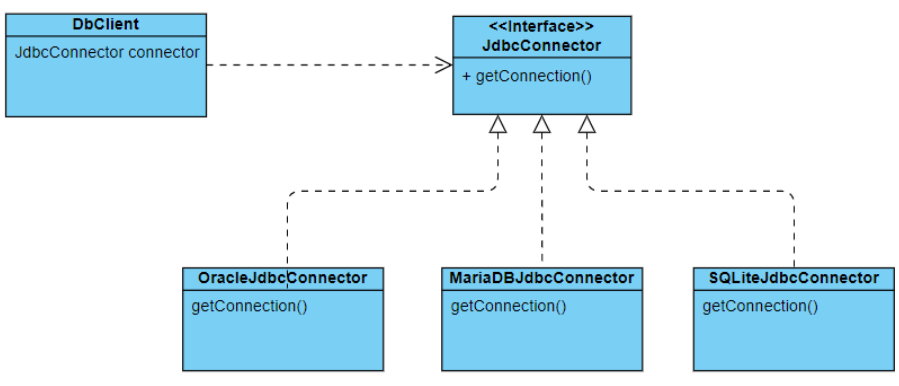

# Portable Service Abstraction
추상화는 자바에서 학습했다시피 클래스의 본질적인 특성만을 추출하여 일반화한 것을 말하며 대표적으로 추상클래스와 인터페이스가 있었다.  
게임을 관리하는 애플리케이션을 설계하며 게임 클래스를 추상화하는 예시를 들어보겠다.  

먼저 게임의 일반적인 특징에는 뭐가 있는지 생각해본다. 게임의 일반적인 속성으로는 장르, 출시일, 플랫폼, 엔진, 등급, 한글화 여부, 멀티 플레이 여부 등이 있겠다.  
그리고 게임의 동작으로는 실행하다, 싱글플레이를 하다, 멀티플레이를 하다 등이 있을 것이다. 코드로 작성해보면 다음과 같을 것이다.  
<pre>
    <code>
        public abstract class Game {
            protected String genre;
            protected String releaseDate;
            protected String platform;
            protected String engine;
            protected boolean korean;
            protected boolean multiPlayer;
            
            protected abstract void run();
            protected abstract void playSingle();
            protected abstract void playMulti();
        }
    </code>
</pre>

## Why do we need it
다음은 Game 추상 클래스를 상속한 클래스들의 코드이다.  

<pre>
    <code>
        // LeagueOfLegends.java
        public class LeagueOfLegends extends Game{
            @Override
            protected void run() {
                System.out.println("리그오브레전드 실행");
            }
            @Override
            protected void playSingle() {
                System.out.println("리그오브레전드는 혼자 못해요");
            }
            @Override
            protected void playMulti() {
                System.out.println("소환사의 협곡에 오신것을 환영합니다");
            }
        }
        // Starcraft.java
        public class Starcraft extends Game{
            @Override
            protected void run() {
                System.out.println("스타크래프트 실행");
            }
            @Override
            protected void playSingle() {
                System.out.println("스타크래프트는 혼자 못해요");
            }
            @Override
            protected void playMulti() {
                System.out.println("로템 1:1 초보만");
            }
        }
        // GtaV.java
        public class GtaV extends Game{
            @Override
            protected void run() {
                System.out.println("GTA5 실행");
            }
            @Override
            protected void playSingle() {
                System.out.println("싱글플레이 하기");
            }
            @Override
            protected void playMulti() {
                System.out.println("멀티 서버 입장");
            }
        }
    </code>
</pre>
위 클래스들은 Game 클래스의 일반화된 동작을 자신만의 고유한 동작으로 오버라이딩하고있다.  
해당 게임에 맞는 클래스를 사용하기 위해선 다음과 같이 접근한다.  

<pre>
    <code>
        public class GameManageApplication {
            Game leagueOfLegends = new LeagueOfLegends();
            Game starCraft = new Starcraft();
            Game gtaV = new GtaV();

            leagueOfLegends.run();
            starCraft.run();
            gtaV.run();
        }
    </code>
</pre>

여기서 중요한 것은 구체화 클래스의 객체를 자신의 타입이 아닌 상위 클래스 참조변수에 할당하여 접근을 한다.  
이렇게 되면 클라이언트(GameManageApplication) 입장에서는 Game이라는 추상 클래스만 일관적으로 바라보며 하위 클래스의 기능을 사용할 수 있게된다.  
이처럼 클라이언트가 추상화 된 상위클래스를 일관되게 바라보며 하위 클래스의 기능을 사용하는 것을 서비스 추상화(PSA)의 기본개념이다.  

### PSA
서비스 추상화란 위와 같은 추상화 개념을 애플리케이션에서 사용하는 서비스에 적용하는 기법이다.  

위 이미지에서는 JdbcConnector가 애플리케이션에서 이용하는 하나의 서비스가 된다.  
JdbcConnector는 OracleJdbcConnector, MariaDBJdbcConnector, SQLiteJdbcConnector 클래스의 상위 추상 클래스이며 DbClient는 JdbcConnector 인터페이스를 통해 느슨하게 결합되어 있다.  
이처럼 애플리케이션에서 특정 서비스를 이용할 때, 서비스의 기능을 접근하는 방식을 일관되게 유지하며 기술 자체를 유연하게 사용할 수 있도록 하는것을 일관된 서비스 추상화(PSA)라고 한다.
<pre>
    <code>
        // DbClient.java
        public class DbClient {
            public static void main(String[] args) {
                // Spring DI로 대체 가능
                JdbcConnector connector = new SQLiteJdbcConnector(); // (1)
        
                // Spring DI로 대체 가능
                DataProcessor processor = new DataProcessor(connector); // (2)
                processor.insert();
            }
        }
        
        // DataProcessor.java
        public class DataProcessor {
            private Connection connection;
        
            public DataProcessor(JdbcConnector connector) {
                this.connection = connector.getConnection();
            }
        
            public void insert() {
                // 실제로는 connection 객체를 이용해서 데이터를 insert 할 수 있다.
                System.out.println("inserted data");
            }
        }
        
        // JdbcConnector.java
        public interface JdbcConnector {
            Connection getConnection();
        }
        
        // MariaDBJdbcConnector.java
        public class MariaDBJdbcConnector implements JdbcConnector {
            @Override
            public Connection getConnection() {
                return null;
            }
        }
        
        // OracleJdbcConnector.java
        public class OracleJdbcConnector implements JdbcConnector {
            @Override
            public Connection getConnection() {
                return null;
            }
        }
        
        // SQLiteJdbcConnector.java
        public class SQLiteJdbcConnector implements JdbcConnector {
            @Override
            public Connection getConnection() {
                return null;
            }
        }
    </code>
</pre>
PSA가 필요한 주된 이유는 <b>어떤 서비스를 이용하기 위한 접근 방식을 일관된 방식으로 유지함으로써 애플리케이션에서 사용하는 기술이 변경되더라도 최소한의 변경만으로 변경된 요구사항을 반영하기 위함</b>이다.  
Spring에서 PSA가 적용된 분야로는 트랜잭션, 메일, Spring Data 서비스 등이 있다.
