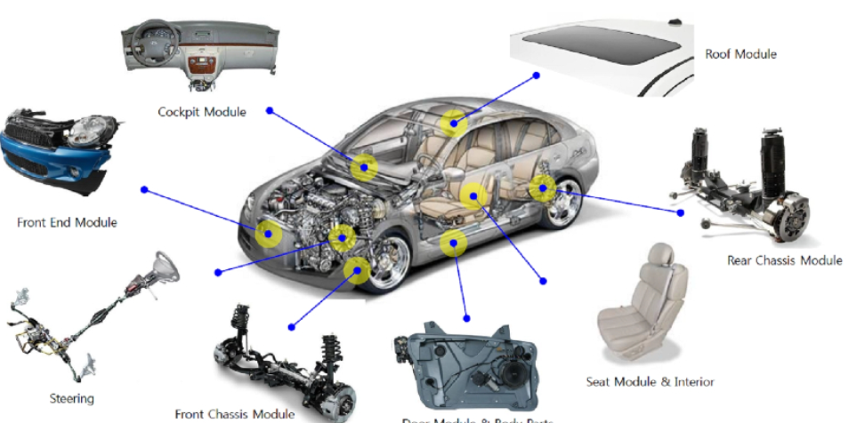

# What is Framework
프레임워크는 어떠한 대상의 큰 틀이나 외형적인 구조를 의미한다.  
자동차의 뼈대가 되는 프레임을 연상하면 쉽게 이해할 수 있다.    

  

또한 하나의 Application을 건물이라 가정한다면 Frame은 건물의 구조라고 생각할 수 있겠다.  
## Why should I use it?
프레임워크의 장점은 다음과 같다.
<ul>
    <li>
    효율적으로 코드를 작성할 수 있다.
    </li>
    
맨 손으로 아무런도구도 없이 집을 짓는것보단 공구세트와 여러 중장비를 준비한 채 집을 짓는 편이 훨씬 효율적일 것이다. 
    이는 프로그래밍에서도 마찬가지다. 개발자는 아무것도 없는 상태에서 일일이 전부 개발하는 것이 아니라 프레임워크에서 제공하는 다양한 기능을 사용해 개발 시간을 줄임과 동시에 비즈니스 로직 작성에 집중할 수 있다.
    

    <li>
    정해진 규약이 있어 애플리케이션의 효율적인 관리가 가능하다.
    </li>
    
프레임워크에서 정해진 규약에 맞게 코드를 작성하게 되기때문에 유지보수가 필요한 경우 더 빠르고 쉽게 문제점을 파악해 수정할 수 있게된다. 
    이는 곧 유지보수 외에도 비슷한 기능을 개발할 때 코드의 재사용이 용이해지며 기능의 확장도 간편하게 해준다.
    

</ul>
그러나 장점만이 있는건 아니며 다음과 같은 단점또한 있다.
<ul>
    <li>
        프레임워크에 대한 학습이 필요하다.
    </li>
    

        프레임워크에서 정해진 규약에 대해 학습을 해야한다. 스프링의 경우 자바언어에 대한 이해또한 필요하며 추가로 스프링이라는 프레임워크의 학습을 요한다.
    

    <li>
        자유롭고 유연한 개발이 어렵다.
    </li>
    

        앞서 프레임워크는 건물의 구조라고 비유를 했다. 건물의 구조 자체를 변경하기 위해선 철거를 한 다음 다시 새롭게 구조를 만들어야할 것이다. 이는 프레임워크에서도 동일하다.
    

</ul>

## Framework vs Library
프레임워크와 라이브러리는 동의어가 아니다, 라이브러리는 애플리케이션을 개발할때 필요한 기능을 미리 구현해놓은 코드들의 집합체이다.  
  
실생활로 예시를 들면 프레임워크는 앞서 말했듯이 자동차의 차체, 라이브러리는 부품에 해당한다.  
차체를 교체하는 것은 사실상 불가능하거나 극히 어렵지만 부품을 교체하는 것은 비교적 쉽다.  
소프트웨어 관점으로 표현한다면 애플리케이션에 대한 제어권의 차이가 있다고 표현할 수 있다.  
라이브러리의 애플리케이션 흐름 주도권은 개발자에게 있으며, 프레임워크의 애플리케이션 흐름 주도권은 프레임워크에게 있다.

## Spring Framework
프레임워크의 종류는 여러가지가 있다, 스프링 프레임워크는 그 중의 하나이며 다음과 같은 장점을 가진다.  
<ol>
    <li>
        POJO(Plain Old Java Object)기반의 구성
    </li>
    <li>
        DI(Dependency Injection) 지원
    </li>
    <li>
        AOP(Aspect Oriented Programming) 지원
    </li>
    <li>
        Java를 사용
    </li>
</ol>

어떻게 자바를 사용하는 것이 장점인가?  
자바는 정적 타입 언어로서 변수의 타입, 메서드의 입출력이 어떤 타입을 가져야하는지 강제하는 특징이 있다.  
이는 곧 협업을 할때 타인의 코드 혹은 내가 작성한 코드의 수정,보완이 용이하기에 런타임에 발생하는 오류를 사전에 방지할 수 있다.  
그렇다면 자바를 사용하는 프레임워크는 스프링말고는 없는것일까?  
물론 아니다. 그러나 스프링은 기업용 엔터프라이즈 시스템[1](#footnote_1)을 제공하기에 많은 기업들이 스프링을 사용한다.
                      
***
<a name="footnote_1">1</a> 기업용 엔터프라이즈 시스템이란 기업의 업무(기업 자체 조직의 업무, 고객을 위한 서비스 등)를 처리해주는 시스템을 의미한다.  
기업용 엔터프라이즈 시스템은 대량의 사용자 요청을 처리해야 하기 때문에 서버의 자원 효율성, 보안성, 시스템의 안전성이나 확장성 등을 충분히 고려해서 시스템을 구축하는 것이 일반적이다.  

