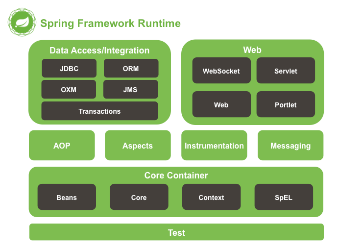

# Introduction to the Spring Framework 번역

## 2. Spring Framework 소개
Spring Framework는 Java 애플리케이션 개발을 위한 포괄적인 인프라 지원을 제공하는 Java 플랫폼입니다. Spring은 인프라를 처리해주므로 애플리케이션에 집중할 수 있습니다.  
Spring은 "plain old Java objects" (POJO)에서 엔터프라이즈 서비스를 비침입적으로 적용하고, Java SE 프로그래밍 모델과 Java EE의 전체 및 일부에 적용할 수 있도록 합니다.  
애플리케이션 개발자로써 Spring 플랫폼에서 어떻게 이점을 얻을 수 있는지 예를 들어보면 다음과 같습니다.
원격 API를 다룰 필요 없이 로컬 Java 메서드를 원격 프로시저로 만들 수 있습니다.
JMX API를 다룰 필요 없이 로컬 Java 메서드를 관리 작업으로 만들 수 있습니다.
JMS API를 다룰 필요 없이 로컬 Java 메서드를 메시지 핸들러로 만들 수 있습니다.
<ul>
   <li>트랜잭션 API를 다룰 필요 없이 Java 메서드를 데이터베이스 트랜잭션에서 실행할 수 있습니다.</li>
   <li>원격 API를 다룰 필요 없이 로컬 Java 메서드를 원격 프로시저로 만들 수 있습니다.</li>
   <li>JMX API를 다룰 필요 없이 로컬 Java 메서드를 관리 작업으로 만들 수 있습니다.</li>
   <li>JMS API를 다룰 필요 없이 로컬 Java 메서드를 메시지 핸들러로 만들 수 있습니다.</li>
</ul>

## 2.1. 의존성 주입과 제어의 역전
Java 애플리케이션 —  제한적이고 내장된 애플리케이션부터 n계층의 서버 측 엔터프라이즈 애플리케이션까지 가장 넓은 범위를 커버하는, 다소 모호한 용어 —  은 보통 서로 협력하여 애플리케이션을 구성하는 객체로 구성됩니다. Java 플랫폼은 다양한 애플리케이션 개발 기능을 제공하지만, 기본 구성 요소를 하나로 조직하는 방법은 제공하지 않아서 아키텍트와 개발자가 이를 처리해야 합니다.  

Factory, Abstract Factory, Builder, Decorator, Service Locator와 같은 디자인 패턴을 사용하여 애플리케이션을 구성하는 여러 클래스 및 객체 인스턴스를 구성할 수 있지만, 이러한 패턴은 이름이 붙은 모범 사례일 뿐입니다. 패턴은 해당 패턴이 하는 일, 적용할 위치, 해결하는 문제 등을 설명한 형식화된 모범 사례일 뿐이며, 애플리케이션에서 직접 구현해야 합니다.

<pre>
배경
<i>"문제는 어떤 제어의 관점이 역전되느냐는 거죠."</i> Martin Fowler는 자신의 사이트에서 이러한 통제의 역전에 대해 의문을 제기했다.  
Folwer는 이 원칙을 더욱 자명하게 하기위해 용어의 이름을 Dependency Injection으로 할 것을 제안했다.
</pre>

## 2.2 모듈
Spring Framework는 약 20개의 모듈로 구성된 기능으로 이루어져 있습니다. 이러한 모듈은 코어 컨테이너, 데이터 액세스/통합, 웹, AOP(Aspect Oriented Programming), Instrumentation, 메시징, 테스트로 그룹화되며 다음 다이어그램과 같이 나타낼 수 있습니다.  
### 그림 2.1 Spring Framework 개요
   

다음 섹션에서는 각 기능에 대해 사용 가능한 모듈을 그들의 아티팩트 이름과 함께 나열하고 다루는 주제를 제공합니다. 아티팩트 이름은 의존성 관리 도구에서 사용되는 아티팩트 ID와 관련이 있습니다.  

### 2.2.1 코어 컨테이너

코어 컨테이너는 spring-core, spring-beans, spring-context, spring-context-support, spring-expression (Spring Expression Language) 모듈로 구성됩니다.  

spring-core와 spring-beans 모듈은 IoC와 의존성 주입 기능을 비롯한 프레임워크의 기본 요소를 제공합니다. BeanFactory는 Factory 패턴의 정교한 구현입니다. 이것은 프로그래밍적으로 싱글톤의 구현 필요성을 제거하고 configuration 및 specification of dependencies을 실제 프로그램 로직에서 분리할 수 있게 해줍니다.

Context (spring-context) 모듈은 Core 및 Beans 모듈이 제공하는 견고한 기반 위에 구축됩니다. : 이는 JNDI 레지스트리와 유사한 방식으로 프레임워크 스타일로 객체에 접근한다는 의미와 같습니다.  

Context 모듈은 Beans 모듈에서 기능을 상속하며 국제화(예: 리소스 번들 사용), 이벤트 전파, 리소스 로딩 및 Servlet 컨테이너에 의한 컨텍스트의 투명한 생성 지원을 추가합니다.  

Context 모듈은 또한 EJB, JMX 및 기본적인 원격 기능과 같은 Java EE 기능을 지원합니다. ApplicationContext 인터페이스는 Context 모듈의 초점입니다.  

spring-context-support는 캐싱(EhCache, JCache) 및 스케줄링(CommonJ, Quartz)과 같은 공통된 제3자 라이브러리를 Spring 애플리케이션 컨텍스트에 통합하기 위한 지원을 제공합니다.

spring-expression 모듈은 객체 그래프를 런타임에서 쿼리하고 조작하기 위한 강력한 표현 언어를 제공합니다. 이것은 JSP 2.1 사양에서 지정된 통합 표현 언어(unified EL)의 확장입니다.  
이 언어는 속성 값의 설정 및 가져오기, 속성 할당, 메서드 호출, 배열, 컬렉션 및 인덱서의 내용에 접근, 논리 및 산술 연산자, 이름이 지정된 변수, Spring의 IoC 컨테이너에서 이름별 객체 검색을 지원합니다. 또한, 리스트 프로젝션과 셀렉션뿐만 아니라 일반적인 리스트 집계도 지원합니다.  

### 2.2.1 AOP와 instrumentation
Spring Framework의 spring-aop 모듈은 AOP Alliance 호환의 관심 지향 프로그래밍 구현을 제공하여, 기능을 분리해야 하는 코드를 깔끔하게 분리할 수 있도록 메서드 인터셉터 및 pointcuts을 정의할 수 있습니다. 소스 수준 메타데이터 기능을 사용하여 .NET attributes와 유사한 방식으로 코드에 행동 정보를 포함할 수도 있습니다.

별도의 spring-aspects 모듈은 AspectJ와의 통합을 제공합니다.

spring-instrument 모듈은 특정 응용 프로그램 서버에서 사용할 수 있는 클래스 계측 지원 및 클래스로더 구현을 제공합니다. spring-instrument-tomcat 모듈은 Tomcat용 Spring’s instrumentation agent를 포함합니다.

### 2.2.3 Messaging
Spring Framework 4에는 Spring Integration 프로젝트의 주요 개념을 기반으로하는 spring-messaging 모듈이 포함되어 있습니다. 이 모듈은 Message, MessageChannel, MessageHandler 등과 같은 핵심 추상화를 제공하여 메시징 기반 애플리케이션의 기반으로 사용됩니다.  
또한, 이 모듈에는 Spring MVC의 어노테이션 기반 프로그래밍 모델과 유사한 메시지를 메소드에 매핑하기 위한 일련의 어노테이션이 포함되어 있습니다. 이를 통해 개발자는 메시지를 처리하는 메소드를 쉽게 작성할 수 있으며, 간단한 코드로도 유연하고 확장 가능한 메시징 애플리케이션을 구축할 수 있습니다.  

### 2.2.4 데이터 접근/통합
데이터 액세스/통합 레이어는 JDBC, ORM, OXM, JMS 및 트랜잭션 모듈로 구성됩니다.  
spring-jdbc 모듈은 번거로운 JDBC 코딩 및 데이터베이스 공급 업체별 오류 코드의 구문 분석을 제거하는 JDBC 추상화 계층을 제공합니다.  
spring-tx 모듈은 특수 인터페이스를 구현하는 클래스 및 모든 POJO(Plain Old Java Objects)에 대한 프로그래밍 및 선언적 트랜잭션 관리를 지원합니다.  
spring-orm 모듈은 JPA 및 Hibernate와 같은 인기있는 객체-관계 매핑 API에 대한 통합 계층을 제공합니다. spring-orm 모듈을 사용하면 앞서 언급한 간단한 선언적 트랜잭션 관리 기능을 비롯한 Spring이 제공하는 모든 기능과 이러한 O/R 매핑 프레임워크를 함께 사용할 수 있습니다.  
spring-oxm 모듈은 JAXB, Castor, JiBX 및 XStream과 같은 Object/XML 매핑 구현을 지원하는 추상화 계층을 제공합니다.  
spring-jms 모듈(Java Messaging Service)에는 메시지 생성 및 소비 기능이 포함되어 있습니다. Spring Framework 4.1부터는 spring-messaging 모듈과 통합되어 제공됩니다.  

### 2.2.5 웹
웹 레이어는 spring-web, spring-webmvc 및 spring-websocket 모듈로 구성됩니다.
spring-web 모듈은 multipart 파일 업로드 기능 및 서블릿 리스너 및 웹 지향 애플리케이션 컨텍스트를 사용하여 IoC 컨테이너를 초기화하는 기본적인 웹 지향 통합 기능을 제공합니다. 또한 HTTP 클라이언트와 Spring의 원격지원의 웹 관련 부분도 포함합니다.  
spring-webmvc 모듈(또는 Web-Servlet 모듈로도 알려져 있음)은 웹 애플리케이션용 Spring의 모델-뷰-컨트롤러(MVC) 및 REST 웹 서비스 구현을 포함합니다. Spring의 MVC 프레임워크는 도메인 모델 코드와 웹 폼 사이에 깔끔한 분리를 제공하며 Spring Framework의 모든 다른 기능과 통합됩니다.

### 2.2.6 테스트
spring-test 모듈은 JUnit 또는 TestNG를 사용하여 Spring 구성 요소의 단위 테스트 및 통합 테스트를 지원합니다. 이 모듈은 일관된 Spring ApplicationContext 로딩과 이러한 컨텍스트의 캐싱을 제공합니다. 또한 코드를 고립시켜 테스트하는 데 사용할 수 있는 모의 객체(mock objects)를 제공합니다.  

***
source : https://docs.spring.io/spring-framework/docs/5.0.0.M5/spring-framework-reference/html/overview.html

