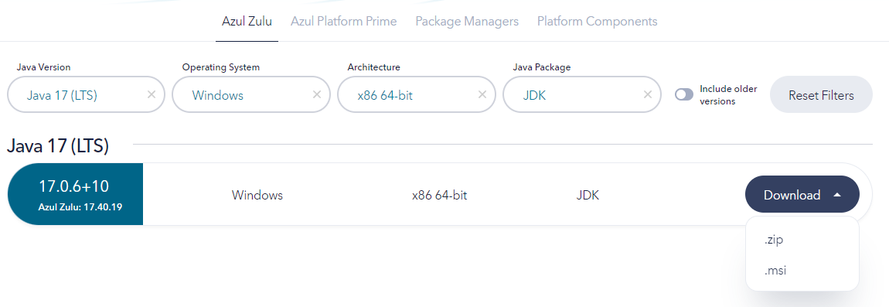
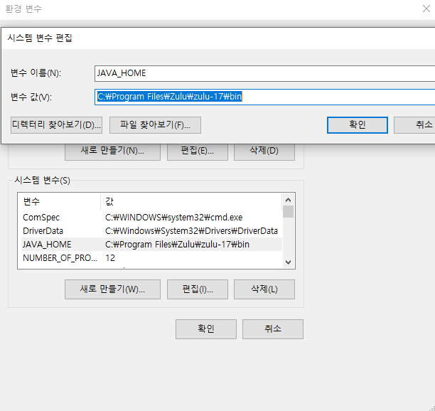
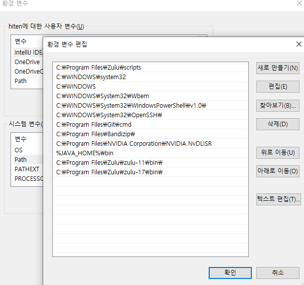
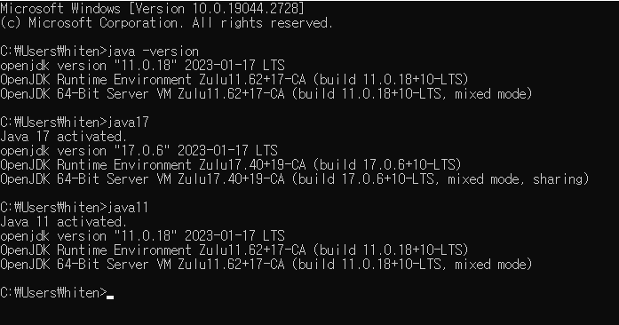

# JDK 여러 버전 설치법
Java 버전을 다양하게 써야하는 상황이 발생한다. 아래는 JDK 여러 버전을 설치하여 필요시 전환하는 방법이다.  

1. 필요한 Java 버전 [설치](https://www.oracle.com/java/technologies/downloads/#java17)

2. 환경 변수 - 시스템 환경변수에 새로 만들기 - 아래와 같이 추가

3. jdk 설치가 되어있는 폴더에 scrpits 폴더 생성후 path 추가  

4. 변환할 jdk파일 갯수만큼 .bat 파일 생성후 아래 코드 입력
``` 
// jdk 11
@echo off
set JAVA_HOME={C:\Program Files\Zulu\zulu-11}
set PATH=C:\Program Files\Zulu\zulu-11\bin;%PATH%
echo Java 11 activated.
java -version
```
``` 
// jdk 17
@echo off
set JAVA_HOME={C:\Program Files\Zulu\zulu-17}
set PATH=C:\Program Files\Zulu\zulu-17\bin;%PATH%
echo Java 17 activated.
java -version
```
5. cmd에서 변환할 java파일명 입력후 변환되는지 확인  



